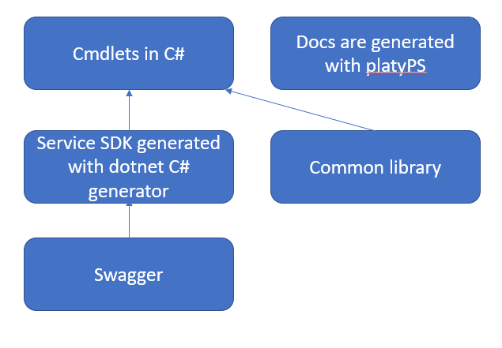
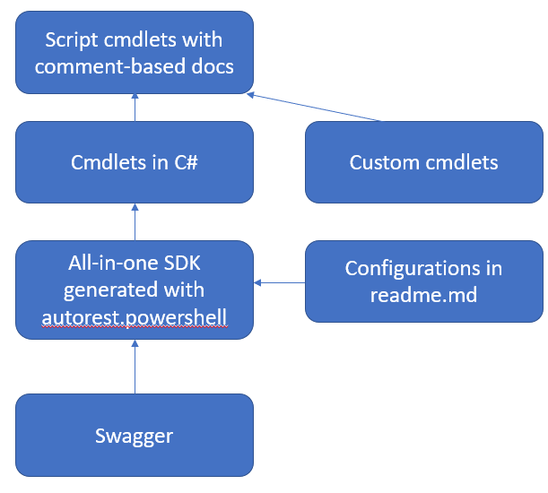

# Description

The document is for those, who are familiar with SDK-based modules and want to give a try with auto-gen modules. The content will contain the comparation between these two kinds of modules from architecture, cmdlets differences, and onboard process, etc.

# Architecture

## SDK-based Module

## Auto-gen Module

# Cmdlet Parameters

Highlight parameters differences in auto-gen modules as below.

- No Set-* cmdlets, Set-* is replaced by New-* and Update-*
- Add *[-SubscriptionId <String[]>]* parameter for get-* cmdlets and add for *[-SubscriptionId <String>]* parameter for the others
- Do not support breaking change warning yet
- Pipeline
    - Do not support to pipe in parent resource
    - Unify two types (through *-InputObject and -ResourceId*) of pipeline into one *-InputObject,* Users could either pipe in the resourceId or resource object
# Implementation

## Process

### SDK-based Module

- Design review
- Get a released management SDK for Dotnet
- Implement cmdlets in C# based on management SDK for Dotnet
- Implement testcases
- Generate docs, and populate them with examples
- Create a PR in master branch for code review

### Auto-gen Module

- Design review
- Write a readme.md as the autorest.powershell configuration for the module, and normally, it should contains
    - links to swaggers in [azure-rest-api-specs](https://github.com/Azure/azure-rest-api-specs) (should pin to specific version through commit id to avoid potential breaking changes)
    - A reference to readme.azure.noprofile.md to inline common configurations
    - Module specific configurations, e.g. *module-version, title, subject-prefix...*
    - directive
- customization
- Implement testcases
- Generate docs and populate them with examples
- Create a PR in **generation** branch for code review
- Azure team members will help merge code from generation branch to master branch

## Customization

### SDK-based Module

Since the cmdlets are handcrafted by developers, no special customization mechanism is required.

### Auto-gen Module

Customization could be done through three ways.

- Through directive in readme.md, please see [directives.md](https://github.com/Azure/autorest.powershell/blob/master/docs/directives.md) for details
- Through PowerShell script, please see [customization.md](https://github.com/Azure/autorest.powershell/blob/master/docs/customization.md) for details
- Through C# code

## Hero Scenario

### SDK-based Module

If your module relies on some other modules, you will need to rely on dotnet SDK of these modules, which could put in your module if only your module depends on them or in Az.Accouts they are some common modules required by several modules. 

### Auto-gen Module

Generally speaking, hero scenarios are implemented through customization through PowerShell script above. Regarding to third party dependencies, there are two ways to handle it.

- Add the swaggers of the dependencies to readme.md either directly or by adding related helpers defined src/helpers if they are common shared modules
- Rely on related Azure PowerShell modules, in this case, it is better you could add the logic to check whether the modules you rely on have installed or not

## Docs and Examples

### SDK-based Module

Docs are generated through playPS, please see [platyPS](https://github.com/Azure/azure-powershell/blob/master/documentation/development-docs/help-generation.md#Installing-platyPS) for details. And developers should populate generated docs with examples.

### Auto-gen Module

Autorest.powershell will generate example stubs in the examples folder, which should be populated by the developers manually. When building, examples in the examples folder will be automatically merged into docs. 

## Test

### SDK-based Module

Tests are written in C# code.

### Auto-gen Module

Tests are written in PowerShell script. And we will leverage PowerShell test framework [Pester](https://github.com/pester/Pester).

# Others

## Data plane support

We are still working on bringing data plane to auto-gen.